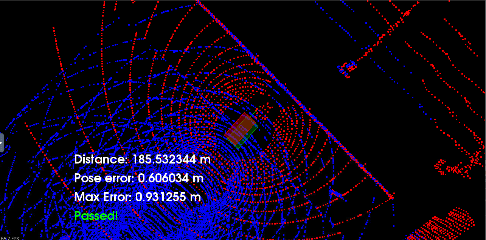

# Scan Matching Localization

The project is part of Udacity Self-Driving Car Engineer Nanodegree program.

For this project, I used NDT.

Note: if you run this project, you need Carla project and you need to run the script multiple times, with each run, the result will get better.

#### Result

